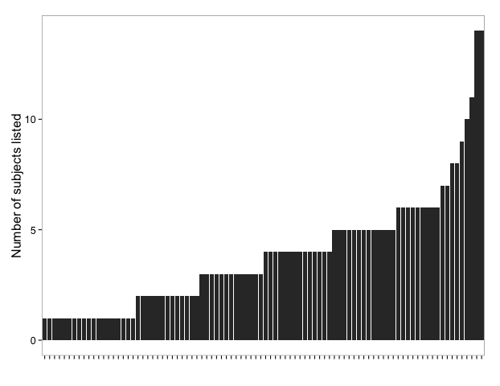
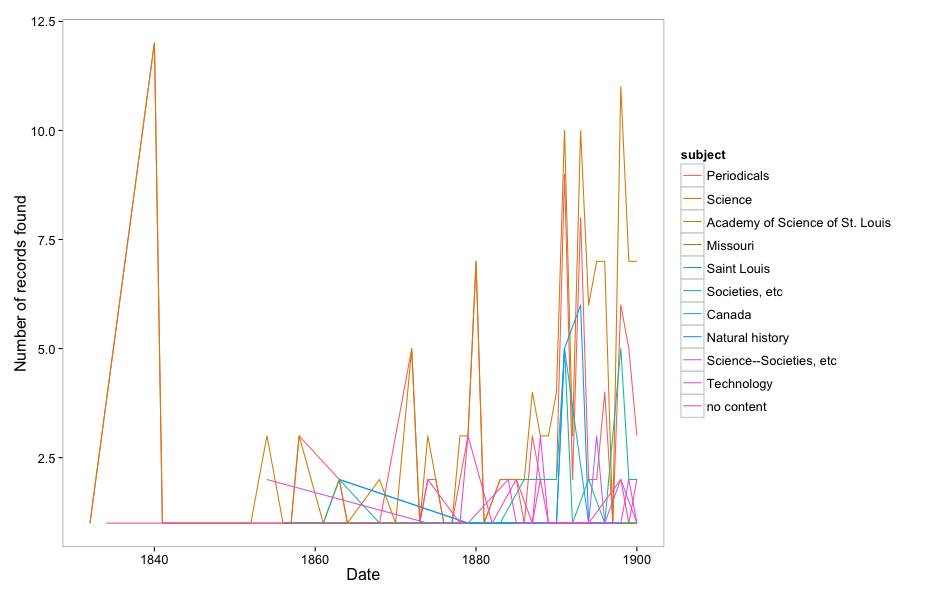

rmetadata
=========

```{r echo=FALSE}
knitr::opts_chunk$set(
  comment = "#>", 
  collapse = TRUE,
  warning = FALSE, 
  message = FALSE
)
```

[](https://travis-ci.org/ropensci/rmetadata)
[](https://ci.appveyor.com/project/sckott/rmetadata)

`rmetadata`: access to scholarly metadata on the web.

## Data sources

### OAI-PMH

The functions prefixed with `md_*` are ones that interact with OAI-PMH metadata.

You can access all the data sources in the [OAI-PMH list of metadata providers](http://www.openarchives.org/Register/BrowseSites), in addition to some sources not on that list (more are available):

+ [DataCite](http://datacite.org/)
+ [PubMed Central](http://www.ncbi.nlm.nih.gov/pmc/)
+ [Hindawi Journals](http://www.hindawi.com/journals/)
+ [Pensoft Journals](http://www.pensoft.net/index.php)

Documentation for OAI-PMH in general [here](http://www.openarchives.org/OAI/openarchivesprotocol.html).

### Datacite

**UPDATE on 2014-10-23**: We're working on a separate package for DataCite = [rdatacite](https://github.com/ropensci/rdatacite) that tworks with their [RESTful search API](http://search.datacite.org/help.html). We moved the DataCite functions out of this package, but may add `rdatacite` as an import later if needed. You can still search on DataCite metadata via OAI-PMH in this package.

### CrossRef

**UPDATE on 2014-10-23**: Crossref is now in a separate package [rcrossref](https://github.com/ropensci/rcrossref)

### Digital Public Library of America

Metadata from the Digital Public Library of America ([DPLA](http://dp.la/)). They have [a great API](https://github.com/dpla/platform) with good documentation - a rare thing in this world. Further documentation on their API can be found on their [search fields](http://dp.la/info/developers/codex/responses/field-reference/) and [examples of queries](http://dp.la/info/developers/codex/requests/).

See below for examples...

### Europeana

We plan to add access to Europeana metadata via their API soon...

* [Europeana API docs](http://labs.europeana.eu/api/)
* [Solr stuff with Europeana](http://kirunews.blog.hu/2014/02/13/solr_query_facets_in_europeana)

### HathiTrust

* Data API docs: http://www.hathitrust.org/documents/hathitrust-data-api-v2.pdf
* Bibliographic API docs: http://www.hathitrust.org/bib_api
* OAI-PMH docs: http://www.lib.umich.edu/michigan-digitization-project-oai-harvesting

### Microsoft Academic Search

Microsoft is no longer supporting the Academic Research API...

<!-- Get your Microsoft Academic Search API key [here](http://academic.research.microsoft.com/About/Help.htm#4). Put your API key in your .Rprofile file using exactly this: `options(MicAcaRes = "YOURAPIKEY")`. See [here](http://academic.research.microsoft.com/about/Microsoft%20Academic%20Search%20API%20User%20Manual.pdf) for API docs. Things to note:

+ The service, application, tool, website, or a feature in a product that you build can be for non-commercial use only or must be available in free version of the product.
+ All their APIs come with the standard 200 queries per minute.
+ Each API call returns only 100 items per call.
+ You can not use the API to crawl the entire corpus. -->

## Quickstart

### Installation

Install `rmetadata` from GitHub:

```{r eval=FALSE}
install.packages("devtools")
devtools::install_github("ropensci/rmetadata")
```

```{r}
library('rmetadata')
```

#### DPLA 

Search metadata from the Digital Public Library of America (DPLA).

```{r eval=FALSE}
dpla_basic(q="fruit", verbose=TRUE, fields=c("publisher","format"))
```

Visualize metadata from the DPLA - histogram of number of subjects per record

```{r eval=FALSE}
# Get results from searching on the terme ecology
out <- dpla_basic(q="ecology", fields=c("publisher","subject"), limit=90)
dpla_plot(input=out, plottype = "subjectsum")
```



Visualize metadata from the DPLA - timeline plot of the top 10 encountered subjects

```{r eval=FALSE}
# Serching for the term science from before the year 1900
out <- dpla_basic(q="science", date.before=1900, limit=200)
dpla_plot(input=out, plottype="subjectsbydate")
```



## Meta

* Please [report any issues or bugs](https://github.com/ropensci/rdatacite/issues).
* License: MIT
* Get citation information for `rdatacite` in R doing `citation(package = 'rdatacite')`

[](http://ropensci.org)
