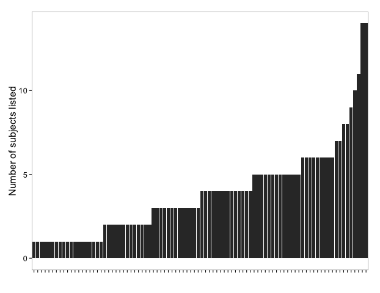

# rmetadata #


`rmetadata` accesses article metadata using the OAI-PMH harvester across many sources. 

You do not need an API key. 

Documentation for OAI-PMH in general [here](http://www.openarchives.org/OAI/openarchivesprotocol.html).


`rmetadata` is part of the rOpenSci project, visit http://ropensci.org to learn more.

### Windows binary at the Downloads page
+ [get a windows binary here](https://files.app.net/1/48944/aNR41Ac2CRbVjdvnwI6EOkqwPwV26nuZWjwRq2qzkLMOYZJLGTxr8ptKb7UW3KBlzYus1I3h64MhOFdyTba-SQ15YN7H937Y1HieAE7oDiKEYqxHYUQbQdfBp4mbo0jGJttXxPocJkv8QvOioYFQlQgtLBIjKd2-FpwjhS7IWfcmZI8spYYkrVEc87xsFsRO6)

### Data sources

You can access all the data sources in the [OAI-PMH list of metadata providers](http://www.openarchives.org/Register/BrowseSites), in addition to some sources not on that list (more will be added later): 

+ [DataCite](http://datacite.org/)
+ [PubMed Central](http://www.ncbi.nlm.nih.gov/pmc/)
+ [Hindawi Journals](http://www.hindawi.com/journals/)
+ [Pensoft Journals](http://www.pensoft.net/index.php)
+ CrossRef API's
	+ [General](http://search.labs.crossref.org/help/api)
		+ [Example call: http://search.labs.crossref.org/dois?q=renear+palmer](http://search.labs.crossref.org/dois?q=renear+palmer)
	+ [OpenURL](http://labs.crossref.org/openurl/)
	+ [Metadata search](http://search.labs.crossref.org/help/api)
	+ [ranDOIm](http://random.labs.crossref.org/)

You can also access metadata from the Digital Public Library of America ([DPLA](http://dp.la/)). They have [a great API](https://github.com/dpla/platform) with good documentation - a rare thing in this world. 

See below for examples...

### Installation 

Install `rmetadata` from GitHub:

```r
install.packages("devtools")
require(devtools)
install_github("rmetadata", "ropensci")
require(rmetadata)
```

### Quickstart

#### Lookup article info via CrossRef with DOI and get a citation
```r
print(crossref_citation("10.3998/3336451.0009.101"), style = "Bibtex")

@Article{,
   title = {In Google We Trust?},
   author = {Geoffrey Bilder},
   journal = {The Journal of Electronic Publishing},
   year = {2006},
   month = {01},
   volume = {9},
   doi = {10.3998/3336451.0009.101},
 }
```

#### Get a random set of DOI's through CrossRef
```r
# Default search gets 20 random DOIs
crossref_r()

[1] "10.1038/171775d0"                   
[2] "10.1017/CBO9780511707346.011"       
[3] "10.1111/j.1749-6632.1972.tb16320.x" 
[4] "10.1111/apha.1935.71.issue-1"       
[5] "10.1007/s11431-008-0243-1"          
[6] "10.1088/0305-4470/19/8/025"         
[7] "10.1364/OL.35.002879"               
[8] "10.1051/forest:198905ART0188"       
[9] "10.1371/journal.pone.0056230.g002"  
[10] "10.1079/9780851994437.0231"         
[11] "10.1074/jbc.M313969200"             
[12] "10.1016/j.freeradbiomed.2010.10.208"
[13] "10.1007/978-1-4612-3660-3_21"       
[14] "10.1016/j.msea.2010.06.064"         
[15] "10.1016/B978-0-12-415795-8.00009-X" 
[16] "10.1016/S0140-6736(01)57920-9"      
[17] "10.1139/z77-087"                    
[18] "10.2307/316344"                     
[19] "10.1111/j.1365-2044.2012.07118.x"   
[20] "10.1007/bf00692798"
```

#### Get a short DOI from shortdoi.org
```r
short_doi(doi = "10.1371/journal.pone.0042793")

[1] "10/f2bfz9"
```


#### Search metadata from the Digital Public Library of America (DPLA).
```r
dpla_basic(q="fruit", verbose=TRUE, fields=c("publisher","format"))

3343 objects found, started at 0, and returned 10

    format                                   publisher
1     Book         New York :Rural Publishing Co.,1893
2     Book              New York :J. Wiley,1869, c1857
3     Book                    [Sacramento? :s.n.],1911
4     Book London :Journal of Horticulture Office,1884
5  Journal              Toronto :The Association,1889-
6  Journal              Toronto :The Association,1889-
7  Journal              Toronto :The Association,1889-
8     Book                   New York,C.M. Saxton,1854
9  Journal              Toronto :The Association,1889-
10    Book             New York :J. Wiley,1870 [c1869]
```

#### Visualize metadata from the DPLA - histogram of number of subjects per record
```r
# GEt results from searching on the terme ecology
out <- dpla_basic(q="ecology", fields=c("publisher","subject"), page_size=90)
dpla_plot(input=out, plottype = "subjectsum")
```




#### Visualize metadata from the DPLA - timeline plot of the top 10 encountered subjects
```r
# Serching for the term science from before the year 1900
out <- dpla_basic(q="science", date.before=1900, limit=200)
dpla_plot(input=out, plottype="subjectsbydate")
```

